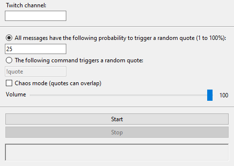

# random_quote
Python script that plays a random audio file based on messages sent in a livestream chat.
I've tested it on both Linux and Windows.

## How it works
This script relies on the following:
+ [mpv](https://mpv.io/) to play audio files
+ [chat-downloader](https://github.com/xenova/chat-downloader) which can be installed with `pip`

The script will wait for messages sent in chat to then trigger an audio file thanks to mpv (cmd/cli) based on how the script was configured.

## Requirements
First, you will need to install Python and mpv. 

If you're on Linux, install them with your usual package manager and get the `chat-downloader` Python module.

### Windows users
#### Python
Python can be downloaded [here](https://www.python.org/downloads/). During the installation, make sure you check the checkbox that says `Add python.exe to PATH`.
Afterwards, remember to do the command `pip install chat-downloader` to install the required module for the script to work.

#### mpv
mpv can be downloaded [here](https://mpv.io/installation/). I suggest clicking the first link that takes you to SourceForge and then clicking the green button that says `Download Latest Version`. You will get a .zip file which you can extract into an empty folder. Double click on the .bat file you just extracted and let it do its thing.

## How to use
1. Download this repository and unzip it anywhere you want on your computer
2. Add your audio files inside the `audio` folder
3. Run the script by either running the `python main.py` command or, for Windows users, by right-clicking the `main.py` and select `Open with` > `Python`



4. A window will show up where you can:
	- fill in the name of the channel you want to track
	- select the way you want quotes to be played;
		- percentage chance per message sent -> make sure the value specified is a number between 1 and 100
		- command -> put any string you want and an audio file will play whenever someone's message contains that string
	- Chaos mode is a mode that doesn't wait for the previous audio file to finish, so it leads to a chaotic mess where audio files overlap
	- adjust the volume by moving the slider
5. The script will automatically update the contents of the `quote.txt` file with the info on who triggered an audio file in case you want to capture that in OBS (`Add` > `Text` > `Read from file`). There is also a large rectangle inside the window that contains the same info if you prefer capturing that.

## Troubleshooting
### tk package missing on Linux
One error I came across so far was when I tested it on Linux and the `tk` module was missing. In my case I just had to install it with the following command (i use arch btw)
```
sudo pacman -S tk
```
For other distros it might be named differently, like `python-tk` or something like that.
